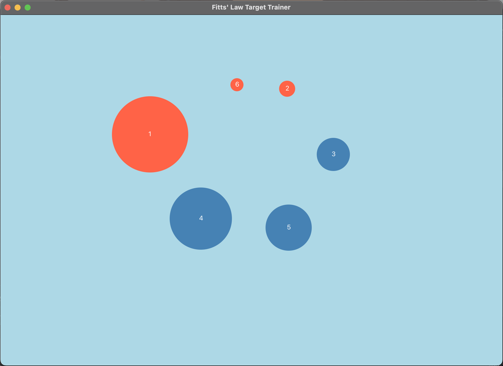
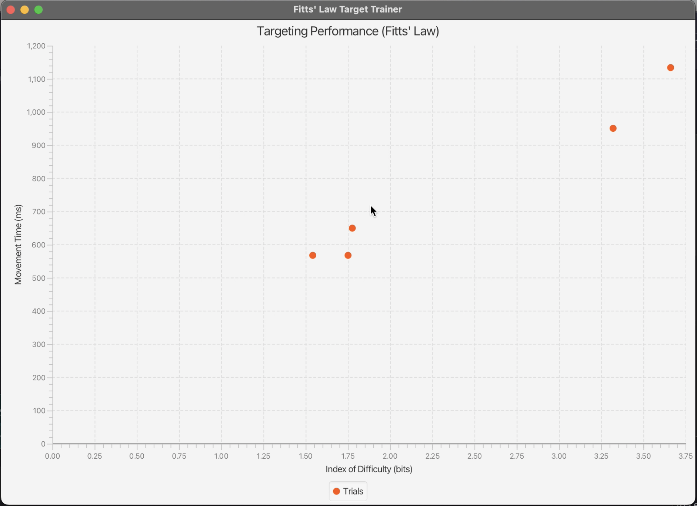

# Ship Application

A JavaFX application that enables users to design and evaluate target-based user interfaces. The app features an editor that allows users to create, arrange, and modify targets, as well as a testing mode that measures their performance using Fitts' Law. Other features include undo/redo and clipboard support, making it easy to experiment with different designs and see how they affect user efficiency and accuracy.

## Overview
* This repository contains all the code for the application which was built using Java with JavaFX framework.
* Implemented using Model-View-Controller architecture, Publish-Subscribe communication model and a 2D immediate-mode GUI.
* Selected targets are drawn with a red fill.

## Application Modes
1. `Control + E` sets the application to Edit Mode.
1. `Control + T` sets the application to Test Mode which allows the user to begin a "Target Trainer" session.

## Supported Actions
1. Creation of targets by `Shift-Clicking`.
2. Selection of single target by `Left-Clicking`.
3. Selection of multiple targets by `Control-Clicking`.
4. Selection of multiple targets by `Left-Clicking` on the background and dragging the mouse to do a rubber-band selection or lasso selection. 
5. Rubber-band/lasso selection while holding the `Control` key deselects existing selected targets. 
6. `Control + C` copies the selected targets.
7. `Control + X` cuts the selected targets.
8. `Control + V` does a paste.
9. `Control + U` undoes the last action.
10. `Control + R` redoes the last action.
10. Move selected targets by a `Left-Click` drag.
11. Resize selected targets by a `Shift-Click` drag left(smaller) or right(larger) on a target.

## Instructions for Running the Application
1. Please download the full source code or clone this repository.
2. Open the folder as an existing project in your IDE of choice (I use IntelliJ).
3. Navigate to `/src/main/java/com/example/targetapplication/application`.
4. Open the main file which starts the application named `TargetApplication.java`.
5. Run the main method by clicking on the play button in the gutter.
